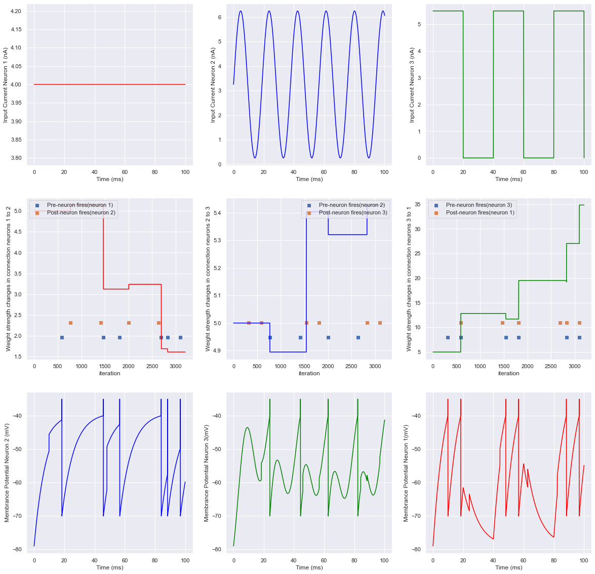
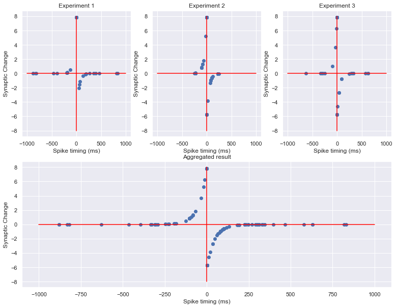
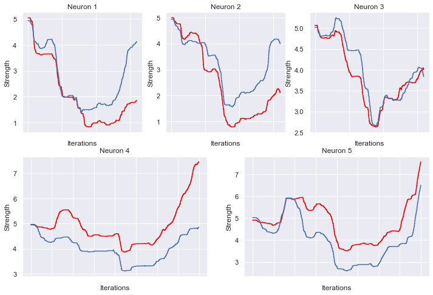

# Spiking Neural Network and STDP
Simulated neural population interactions using STDP learning rule. Implemented Spiking neural network using R-STDP learning rule from scratch.

### STDP
Interactions between neurons in a population consists of 3 neurons using STDP learning rule is demonstrated in the follwoing plot.

Other expriments are available at `images/` and [this notebook](simiulation_STDP.ipynb).

Synaptic changes based on different spike timing is illustrated in the following plot.

### SNN
Created a two layer SNN. First layer contains 5 neurons and second layer has two neurons which each of them represents True or False in the dataset which is available at `data/`. After fitting the model for 5 epochs and 100 iterations, 100% accuracy on the test set is achieved.

Changes in connection strength between neurons in the first layer and neurons in the second layer are shown in the followning plot.

