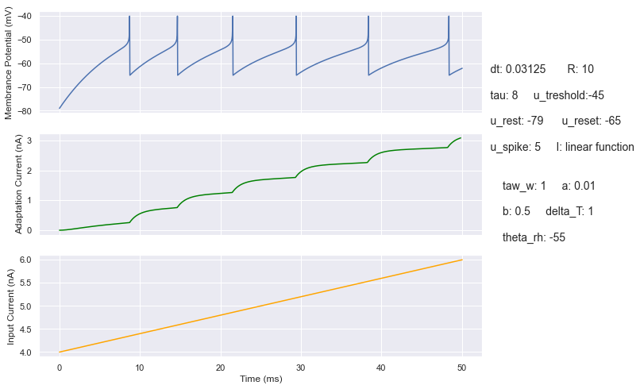
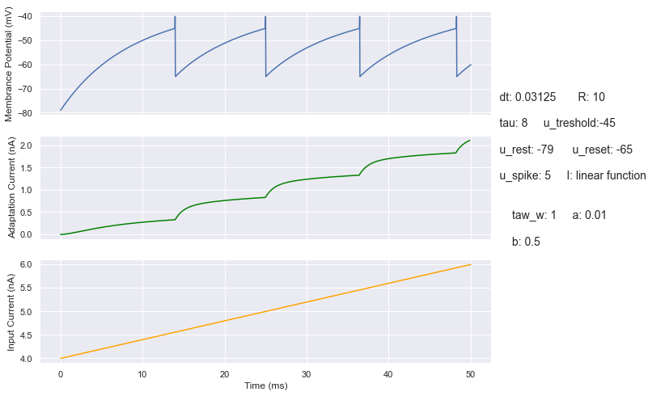
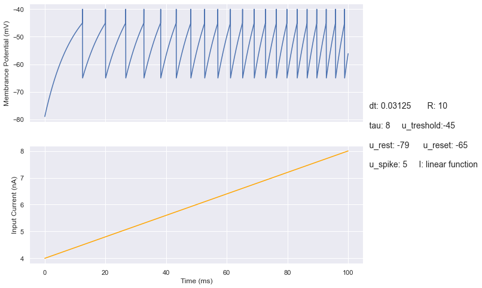

# Neuron Models
Implemented LIF (Leaky integrate-and-fire), Adatptive LIF, and Adaptive Exponential LIF neuron models from scratch in python.

Neuron performance for linear input, results of other inputs are available in `images/` and [this notebook](simulation.ipynb):

