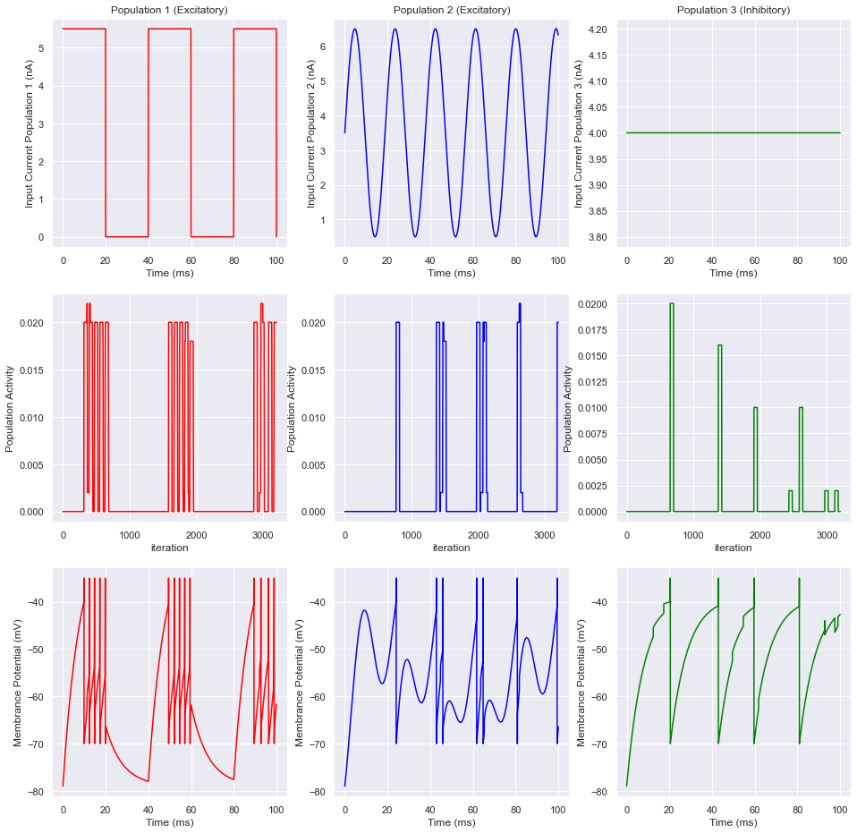
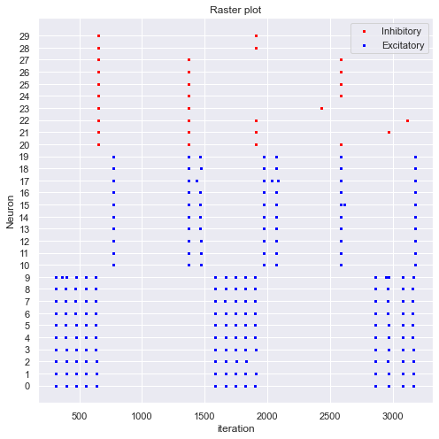

# Neural Population
Implemented neural population from scratch in Python. Each neuron can be excitatory or inhibatory and affect connected neurons with specific weight. 

A neural population consists of 3 LIF neuron (2 of them are excitatory and one of them is inhibatory) and they are fully-connected. Input current, population activity, and membrance potential of each neuron and their influences are demonstrated in the following plot:

Raster plot of the population:

Other examples are available at `images/` and [this notebook](population.ipynb). 